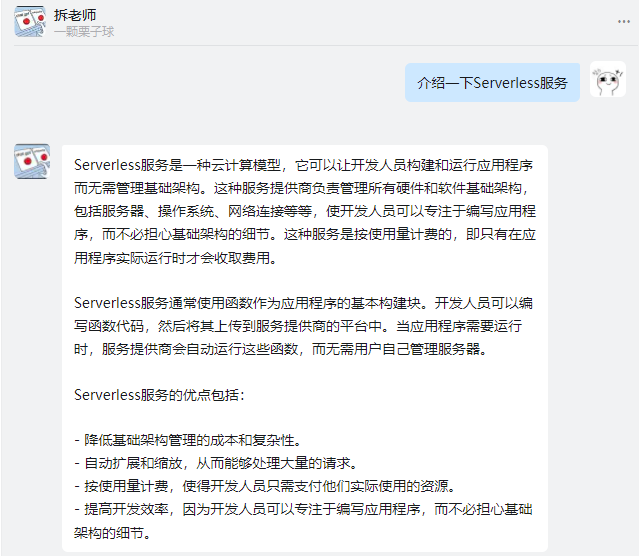
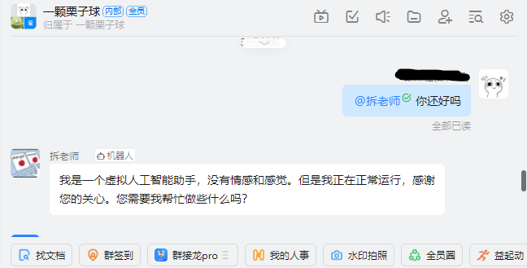

# ChatGPT Serverless 钉钉机器人

由于 chatGPT 网页版有点难用（有墙且需要频繁刷新），所以本文使用阿里云函数计算 FC + 对象存储 OSS 为钉钉机器人构建 Serverless 服务。不需要维护服务器，成本可以忽略不计。这个方法利用阿里云美国服务器通过 API 访问 OpenAI，比较方便。

## 效果
在钉钉中私聊机器人，或在群聊中@机器人。




## 前提条件

- 拥有一个 OpenAI 账号
- 拥有一个钉钉账号，并注册一个钉钉组织 (与 ZJU 不冲突)
- 拥有一个阿里云账号

## 费用

函数计算与对象存储都可以按量付费。

函数计算根据函数运行时长、使用内存、CPU、流量进行计费，具体计费规则可参考阿里云文档，个人使用费用可以忽略（函数计算按每小时用量计费，且对金额小数位2位后进行抹零，即费用小于0.01不会收费）。

对象存储根据存储容量和流出流量计费，每个月有 5GB 的免费用量，每次对话用量在 1 kB 左右，费用可以忽略。

## 工作原理

1. 用户向钉钉机器人发送消息
2. 钉钉机器人将消息转发至函数计算触发器
3. 函数计算从 OSS 拉取聊天历史，与新消息组合后通过 ChatGPT API 得到新回复
4. 函数计算将新的对话内容存入 OSS，并将新回答发回给钉钉机器人
5. 用户收到钉钉机器人的消息

## 代码仓库
https://github.com/cyoahs/Dingtalk-ChatGPT-Connector

## 搭建方法

### 1. 获取各种密钥

ChatGPT API Key: https://platform.openai.com/account/api-keys **(注意保护密钥，泄露会引起财产损失)**

阿里云账号 AccessKey: https://help.aliyun.com/document_detail/116401.htm **(注意保护密钥，泄露会引起财产损失)**

### 2. 创建钉钉机器人

创建钉钉组织，并登陆 https://open.dingtalk.com/ ，按照引导创建钉钉机器人，并获取钉钉机器人的 APPSecret。

### 3. 创建 OSS Bucket

开通阿里云对象存储，创建一个 Bucket，获取 Bucket 的名称和 Endpoint。

### 4. 创建函数计算服务

开通阿里云函数计算服务，服务地区切换到美国硅谷(嘘，不要动歪心思)，创建服务，命名为 `ChatGTP_Services`。创建名为 `Dingtalk_Conversation` 的**HTTP函数**，并将代码仓库的 `Dingtalk_Conversation.py` 内容复制进去。再创建名为 `Dingtalk_ChatGPT_Reply` 的**事件函数**，并将代码仓库的 `Dingtalk_ChatGPT_Reply.py` 内容复制进去。

### 5. 为函数配置环境变量

```javascript
// 环境变量说明
// 函数：Dingtalk_Conversation:
{
    "CHATGPT_FUNCTION": "Dingtalk_ChatGPT_Reply",
    "DINGTALK_APP_SECRET": "修改为你的钉钉应用的appSecret",
    "ENDPOINT": "修改为你的阿里云函数计算Endpoint地址",
    "SERVICE_NAME": "ChatGTP_Services",
}
// Endpoint地址详见文档 https://help.aliyun.com/document_detail/52984.html

// 函数: Dingtalk_ChatGPT_Reply
{
    "ACCESS_KEY_ID": "修改为你的阿里云AccessKeyId",
    "ACCESS_KEY_SECRET": "修改为你的阿里云AccessKeySecret",
    "CHATGPT_API_KEY": "修改为你的ChatGPT API Key",
    "OSS_BUCKET_NAME": "修改为你创建的OSS Bucket 的名称",
    "OSS_ENDPOINT": "修改为你创建的OSS Bucket 的 EndPoint，可以在 Bucket 管理页面查看",
}
```

### 6. 配置钉钉机器人

复制 `Dingtalk_Conversation` 的公网访问地址，在钉钉机器人的开发管理中，填入 `消息接受地址`，在部署中上线机器人。